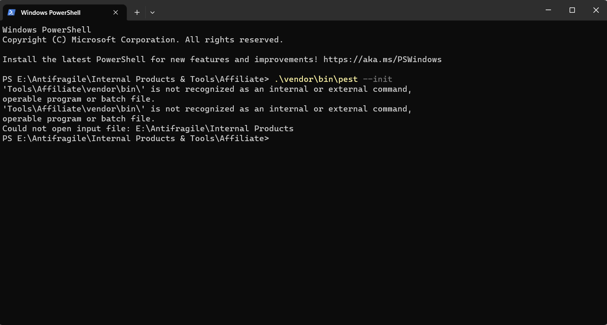

### Source: Honest Work

### Introduction
If you are from windows or a regular windows user or you simply have habit of using spaces in directory names.
The worst you can do is even include special characters like ampersand ``&``.
Consider a directory name ``Internal Tools & Projects``.

### Problem
In a typical scenario, it's fine. Nothing wrong with it. However, it will cause problems when you are working with 
command line tools or referencing the directory in your code. For whitespaces, you will have to do some extra stuff
like wrapping in double quotes or something else. But for special characters, it's chaos.
You will face issues that you will not suspect that it's because of the directory name. 
You would be tempted to think that it's an issue with the tool or the code.

### Recommended Solution
You can use underscore ``_`` or hyphen ``-`` instead of whitespaces. For special characters like ampersand ``&``,
avoid using them.

### Spoiler

