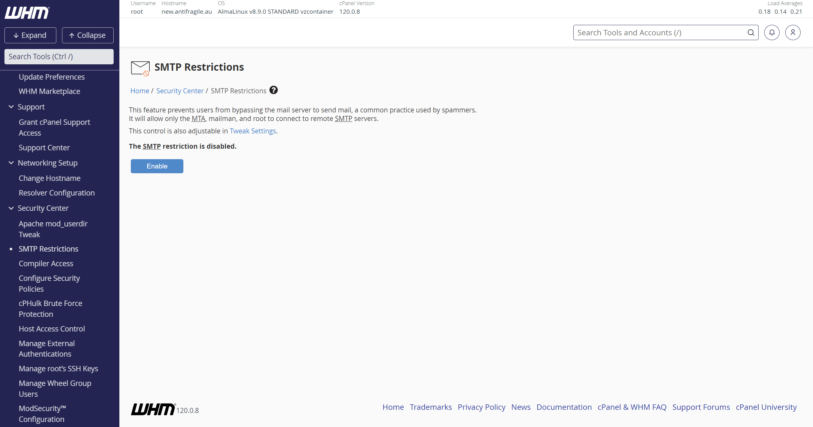

### Source: Honest Work (Written by Myself)

## Overview
There could be multiple errors that can occur. We'll start with issues that are more related to the server than your
codebase or smtp account.

### Server Settings
If you have a VPS, there's SMTP restrictions settings in WHM/root account. It's enabled by default. Disabling it should
solve the issue.

### CA bundle issue
There can be multiple error messages that can occur. The theme of all those errors is that something related to your SSL/TLS
broke down. If you configurations are fine, it's likely due to CA bundle or certificates of your server. Fixing the CA
bundle issues are very well defined in this 
[PHP mailer Github Wiki](https://github.com/PHPMailer/PHPMailer/wiki/Troubleshooting#certificate-verification-failure).

