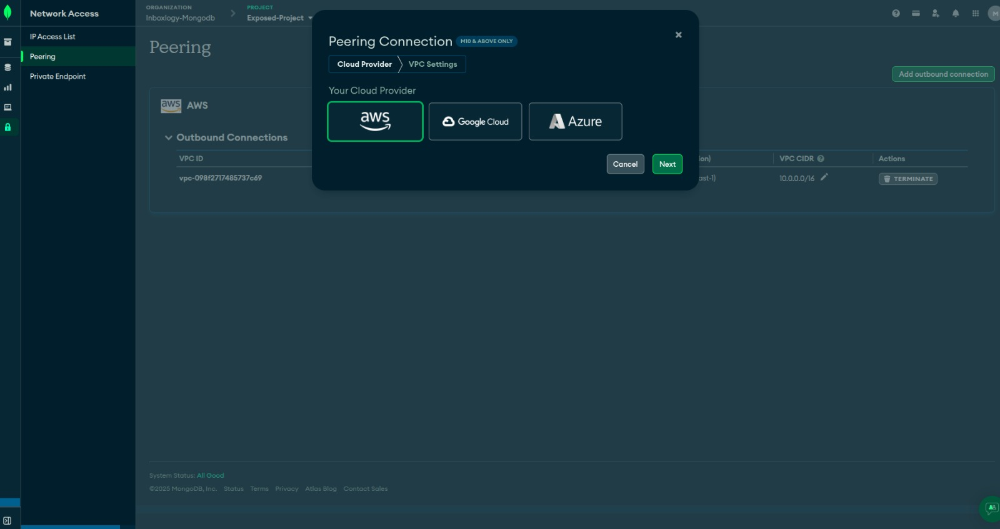
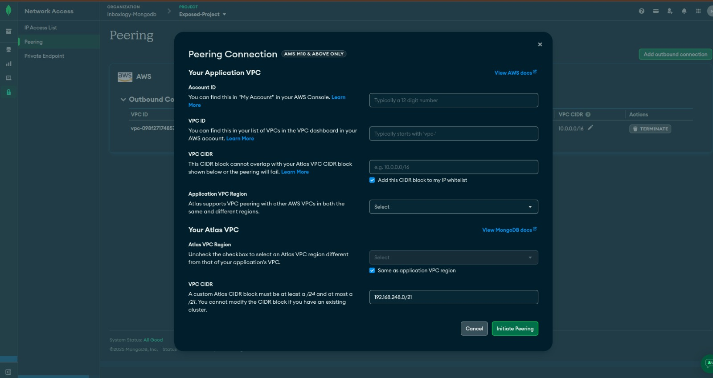

If you want to connect multiple Mongo Atlas Clusters to your AWS VPC, the no cost option is to use Peering Connection.

However, this has a limitation if you've already used a Peering Connection. The limitation forbids customization of Atlas
VPC CIDR if there's a cluster in Project. You need to delete the cluster first (not feasible always) and then specify custom
CIDR Block. Custom CIDR block is required to avoid overlapping with AWS VPC CIDR or with CIDR of existing Peering Connection.

Apart from this, there are few settings to be aware of while setting up Peering Connection.
In Mongo Atlas, Go to Network Access > Peering Connections and click on "add outbound connection". It'll show a modal
like this 👇

Select AWS as your provider and click on "Next". It will show you a screen like this 👇

In details, Account ID & VPC ID are pretty simple. The gotchas lie in VPC CIDR (AWS VPC CIDR) & VPC CIDR (Mongo Atlas) 
Under ``Your Atlas VPC``section. 

Once Peering connection is created, you need to accept it in AWS Console. Sometimes, it barely takes 1 minute and at other
times, it may take 5-15 minutes.

Pay attention to the following points while setting up Peering Connection:
1. AWS VPC CIDR can't overlap with Atlas VPC CIDR. It may create a peering connection but it won't work.
2. Mongo Atlas CIDR needs to be unique in Peering Connection. If you already have a peering connection with same CIDR, 
   connections to Cluster won't work from your AWS VPC.
3. After accepting Peering Connection in AWS Console, you need to add routes to your subnets with the CIDR of Mongo Atlas and selecting
   Peering Connection as target. Connections to Cluster from AWS VPC won't work without this step.
4. Make sure that DNS resolution is enabled for your VPC. This will allow you to resolve the DNS names of your Mongo Atlas clusters.
