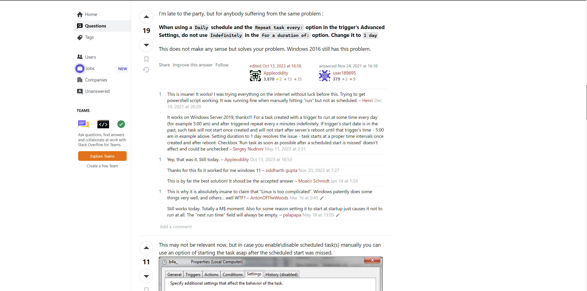

### Source: Honest Work (Written by Myself)

## Overview
Windows Task Scheduler is well known for being stupid, just like the legacy of most Microsoft products. Here, some issues
observed in task scheduler are discussed.

### Run Task every 1 minute
There's no 1 minute frequency in the dropdown. However, you can click and edit it's contents. If you set it to
``1 minute``, your task will run every 1 minute. It's wild that you can edit dropdown content like this and Microsoft hasn't
bothered in ages to provide "1 minute" as option.

### Task does not start on it's due time
If you had scheduled a task to run indefinitely and start at a given datetime, your start date will be in past after a day.
In this case, once the task is shutdown in any way (system restart, process crashed etc.), the task will not start because
the start date is in past. A solution is provided by [This ServerFault Answer](https://serverfault.com/a/1084506).
Copy Paste of answer & screenshot is added below in case this answer is lost/removed by the time you're reading this.
```
I'm late to the party, but for anybody suffering from the same problem :
When using a Daily schedule and the Repeat task every: option in the trigger's Advanced Settings, do not use Indefinitely 
in the for a duration of: option. Change it to 1 day
This does not make any sense but solves your problem. Windows 2016 still has this problem.
```

[Another answer along the same lines!](https://superuser.com/a/1819607/1685774)

### Do NOT use Conditions
It is easy to mistake them as extra actions to ensure task runs. For example "wake computer to run task". However, small
text on the top says that alongside trigger, these conditions must be true as well; else, task will not run.

