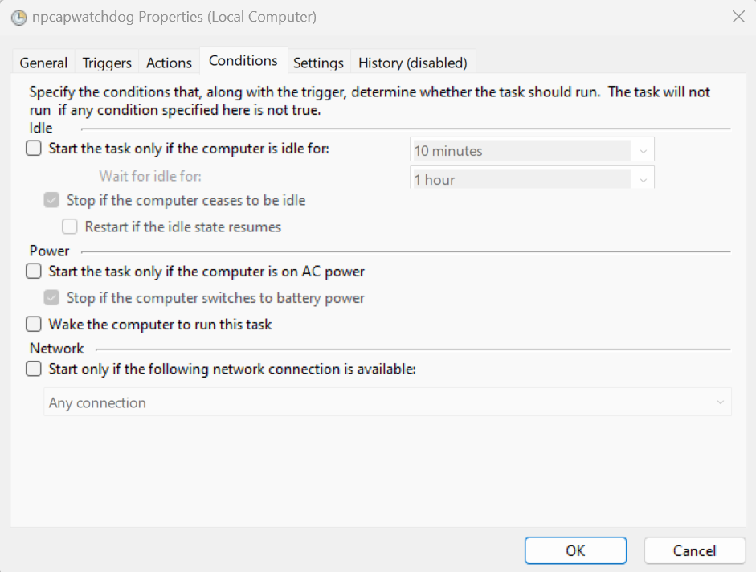

### Source: Honest Work (Written by Myself)

## Outline and rough draft
Use it if you know what you're doing and it's fulfilling your needs. Beware that it might not turn out to be feasible
for upgrades/adding new features. Shopify is relatively (to other platforms like wordpress) restricted when it comes 
to customizations. You need apps for that and most likely they will cost you anywhere $10-30/month. Even those apps
work in hacky ways. For example, doing things on the fly in Javascript which means the change/functionality happens once
page is loaded. An example of it is showing VAT incl prices if customer is from a VAT applicable country.
There's a lot more like this.
Moreover, forget about customizing the checkout page. It's a miracle that they allow customizing checkout form fields.

However, if you're a non-tech person and you would be paying for running it, then it probably doesn't matter much for you;
Although the cost can be high as it takes more time to do hacky things.
If you are someone who will fuck around on their own, then wordpress is a better choice. No doubt that wordpress is wild
and if you're not careful in hosting & choice of themes, plugins, you're in risk like getting malware which breaks your site.
For wordpress, all options are table. You can customize plugins code, theme code. You can even customize the wordpress code
as well since it's hosted by you (although you shouldn't and you won't need).
Wordpress gives you so many options!

